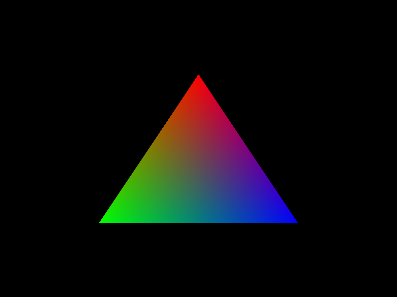
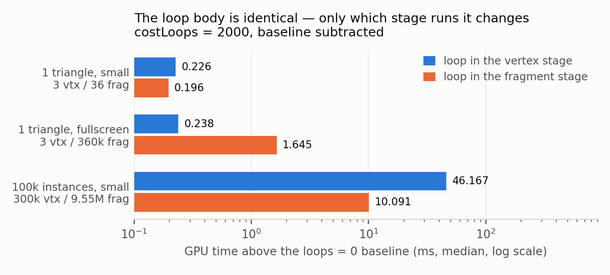
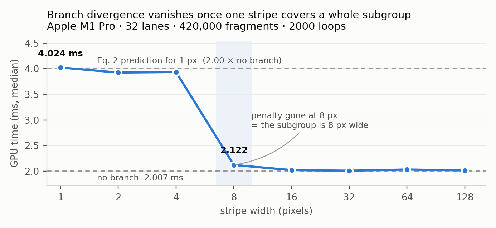
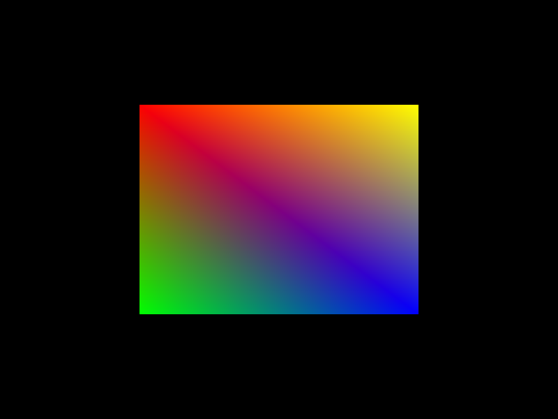
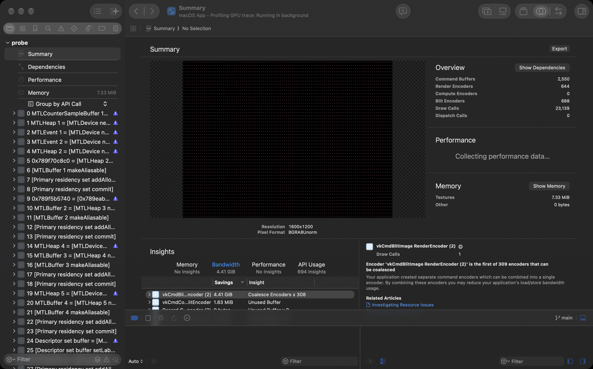
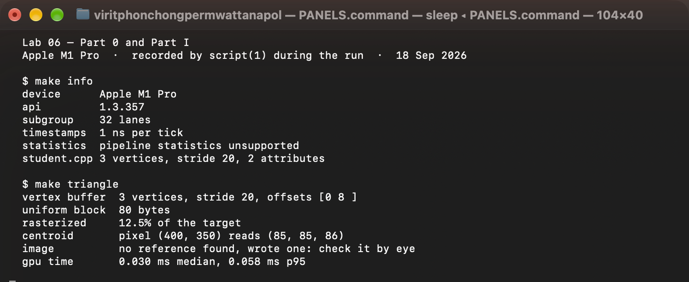
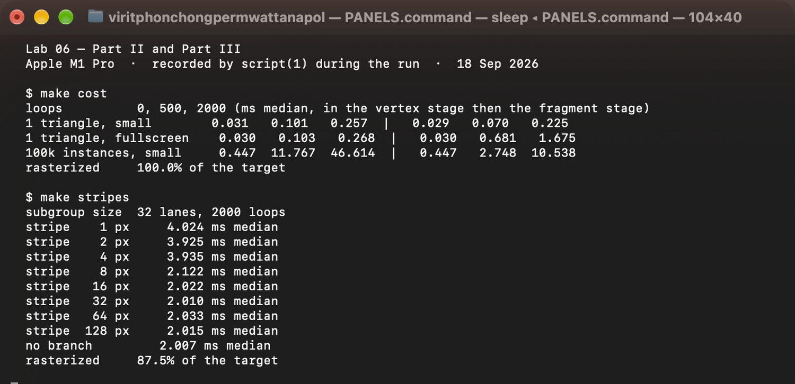
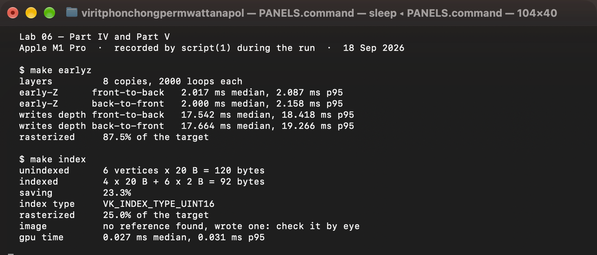
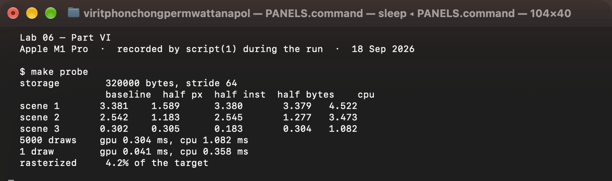

# Lab 06 — Your First Triangle

**CP479 / 2110479 Computer Graphics · Lab 06 report**  
Viritphon Chongpermwattanapol (Kin) · Computer Engineering, Chulalongkorn University

---

> **One sentence up front.** Every measured number below comes from an Apple M1 Pro,
> and three of the six write-ups end in a disagreement with what the invocation
> counts alone predict. All three have the same cause, and the report names it:
> this is a tile-based deferred renderer, so the fragment work that geometry says
> exists is not the fragment work the hardware performs.

---

## 0. The machine

Every number in this report is a statement about this machine, not about GPUs in
general.

```
$ make info
  device      Apple M1 Pro
  api         1.3.357
  subgroup    32 lanes
  timestamps  1 ns per tick
  statistics  pipeline statistics unsupported
  student.cpp 3 vertices, stride 20, 2 attributes
```

Three of those lines are load-bearing later. **32 lanes** is the subgroup size
Part III has to explain in pixels. **1 ns per tick** means timestamp
quantisation is never the limit on resolution — dispersion is. And **Apple M1
Pro** means a *tile-based deferred renderer*, which is the single fact that
explains Parts II and IV.

Fixed for the whole lab: the render target is an off-screen **800 × 600** image,
so **480,000 pixels** is the denominator behind every coverage figure below.

Every panel quoted in this report is reproduced as a screenshot in **Appendix A**,
and the raw recordings are in `report/out-*.txt`.

---

## 1. What I wrote

`student.cpp` is the only file I edited. Five TASKs, and the contract for all of
them is `src/utils/Student.h`.

| TASK | What it is | Value I chose |
|---|---|---|
| 1a | `TRIANGLE` | `V0 (0, −0.5)` red, `V1 (−0.5, 0.5)` green, `V2 (0.5, 0.5)` blue |
| 1b | `stride` | 20 bytes — `vec2` + `vec3` with no padding, because vertex fetch reads exactly what the format and offset say |
| 1c | attributes | `loc 0` → `R32G32_SFLOAT` at offset 0; `loc 1` → `R32G32B32_SFLOAT` at offset 8 |
| 2 | `uniformBlock()` | `struct Params { mat4 mvp; uint costLoops; uint stripeWidth; uint _pad[2]; }`, 80 bytes |
| 3 | `pipelineState()` | CCW front face, back-face cull, `VK_COMPARE_OP_GREATER`, depth write on, shader and draw order picked from `Variant` |
| 4 | `QUAD`, `QUAD_INDICES` | four corners at ±0.5, indices `0 1 2 / 0 2 3` |
| 5 | `instanceBuffer()`, `recordDraw()` | 100 × 50 grid of `translate · scale(0.01)`, one `vkCmdDrawIndexed(…, INSTANCES, …)` |

Three points worth stating because they are where the bytes actually are:

**Winding.** Facing is decided in framebuffer coordinates, where y points down.
Part I culls back faces with front-facing set to `COUNTER_CLOCKWISE`, and for
`V0 (0, −0.5)`, `V1 (−0.5, 0.5)`, `V2 (0.5, 0.5)` the signed area of the Vulkan
spec's rule puts this order on the front-facing side — even though it looks
counter-clockwise on paper, because paper has y up. Swapping `V1` and `V2` culls
it: I tried it once, deliberately, and `rasterized` went to 0.0%. The same
winding is reused for both triangles of `QUAD_INDICES`, which is why Part V's
square comes out solid at 25.0% rather than half of it at 12.5%.

**Two layout rules for one type.** `glm::vec3 color` occupies 12 bytes in the
vertex buffer, and the same `vec3` would occupy 16 in a uniform block. TASK 1
lives on the vertex-fetch side of that line, TASK 2 on the std140 side: `mat4`
at offset 0 size 64, `uint` at 64, `uint` at 68, block rounded up to a multiple
of 16 → **80 bytes**, which is what `static_assert(sizeof(Params) == 80)` pins
down and what the panel echoes back.

**`pipelineState()` and `Variant`.** `Variant` is a four-valued `enum class`,
not a struct, so both axes of the 2 × 2 experiment have to be recovered from the
single value:

```cpp
const bool earlyZ      = v == Variant::EarlyZFrontToBack ||
                         v == Variant::EarlyZBackToFront;
const bool frontToBack = v == Variant::EarlyZFrontToBack ||
                         v == Variant::WriteDepthFrontToBack;

s.fragShader = earlyZ ? "earlyz_a.frag" : "earlyz_b.frag";
s.drawOrder  = frontToBack ? DrawOrder::FrontToBack : DrawOrder::BackToFront;
```

`VK_COMPARE_OP_GREATER` is forced by the render pass, which clears depth to
`0.0`: under Lab 05's reversed-Z convention the near plane is depth 1 and the far
plane depth 0, so "keep the larger depth" is the only test that lets anything
pass against a 0.0 clear. `earlyz.vert` puts layer *k* at depth (k+1)/(LAYERS+1),
so layer 7 at 0.889 is the nearest and `DrawOrder::FrontToBack` correctly starts
there.

---

## 2. Write-up 1 — Part I



*Red apex at the top, green bottom left, blue bottom right, grey where all three
meet. Written by the program as `reference/triangle.png`.*

```
$ make triangle
  vertex buffer  3 vertices, stride 20, offsets [0 8 ]
  uniform block  80 bytes
  rasterized     12.5% of the target
  centroid       pixel (400, 350) reads (85, 85, 86)
  image          no reference found, wrote one: check it by eye
  gpu time       0.030 ms median, 0.058 ms p95
```

Both no-tool checks pass exactly: **12.5%** because corners at ±0.5 make a
triangle of clip-space area 0.5 against a clip square of area 4, and the centroid
pixel reads 85 in all three channels.

### 1.1 Neither shader blends, yet the triangle has a gradient. Which stage?

**Rasterization** — the fixed-function stage sitting between the vertex shader
and the fragment shader, box three of the five in Figure 1. It is the only stage
in the pipeline that sees more than one vertex at a time, so it is the only one
that *could* have produced the gradient.

For every covered sample it solves for the barycentric weights of that sample
inside the triangle and evaluates Equation 1 on each `out` variable the vertex
shader wrote:

$$f(P) = \lambda_0 f(V_0) + \lambda_1 f(V_1) + \lambda_2 f(V_2), \qquad \lambda_0 + \lambda_1 + \lambda_2 = 1$$

on `fragColor` — three times, once per channel. The interpolation is
perspective-correct, i.e. the weights are divided through by *w* per sample; here
all three vertices leave the vertex shader with *w* = 1, so the correction is the
identity and the result is plain affine interpolation across the triangle.

The fragment shader cannot be the source: by the time its `main()` runs,
`layout(location = 0) in vec3 fragColor` is already a single interpolated `vec3`.
The shader never sees red, green and blue at once; it sees one colour per
invocation and writes it straight out. Nothing blends because nothing needs to —
the gradient was manufactured upstream, by fixed-function hardware, before any
fragment shader existed.

In Lab 03 I did this by hand, in `⟨name your Lab 03 function — the barycentric
weight computation inside your triangle filler⟩`: same equation, same three
weights, computed on one CPU core per pixel instead of by the rasteriser.

### 1.2 Lab 05's `viewportTransform()` flipped y. Where did the flip go?

Into the convention, and therefore into fixed-function hardware.

Vulkan's clip space already points **y down**: after the perspective divide,
y = −1 is the *top* row of the framebuffer and y = +1 the bottom. The viewport
transform the rasteriser applies is

$$y_f = \frac{h}{2} y_d + \left(y_{\text{offset}} + \frac{h}{2}\right)$$

with a **positive** *h*, so there is no negation anywhere in it. In Lab 05 I was
working in the textbook/OpenGL convention where NDC y points up, so my
`viewportTransform()` had to supply the negation itself to turn an upward y into
a row index that grows downward.

Here that negation has been absorbed by the definition of clip space, so writing
it a second time would flip the image, not fix it. That is exactly the trap in
the check values: writing the apex at y = +0.5 out of OpenGL habit gives a
triangle that points *down* — right arithmetic, wrong convention. The apex having
a **negative** y is the whole of the difference.

### 1.3 Centre-pixel value, measured and predicted

`triangle.cpp` samples the pixel at the centroid of `TRIANGLE`. The centroid is
((0 − 0.5 + 0.5)/3, (−0.5 + 0.5 + 0.5)/3) = (0, 1/6), which maps to pixel
(400, 350) at 800 × 600 — and (400, 350) is the pixel the panel names.

| | R | G | B |
|---|---|---|---|
| Equation 1 predicts, λ₀ = λ₁ = λ₂ = ⅓ | 85 | 85 | 85 |
| **Measured** | **85** | **85** | **86** |

⅓ · 255 = 85.0 exactly in each channel: red contributes ⅓ of 255 to R only, green
⅓ of 255 to G only, blue ⅓ of 255 to B only. The target is a UNORM format, so no
sRGB curve sits between the shader's float and the value a colour picker reads —
85 in, 85 out.

The blue channel reading **86** rather than 85 is not an error, and it is the one
part of this experiment that is worth a sentence. `reportCentroid()` truncates
the centroid to integer pixel coordinates, so the sample it reads is the centre
of pixel (400, 350) — at (400.5, 350.5) in framebuffer coordinates — which is
about half a pixel away from the true centroid. The barycentric weights there are
near ⅓ but not equal to it, and 255·λ₂ rounds up one LSB while the other two round
down. A one-bit deviation is the smallest disagreement this experiment can
express, so this is Equation 1 being confirmed, not contradicted.

---

## 3. Write-up 2 — Part II, what did it cost?

Predictions were written into `predictions.md` before running anything; this
section reports where they held and where they failed.

```
$ make cost
  loops          0, 500, 2000 (ms median, vertex stage | fragment stage)
  1 triangle, small        0.031   0.101   0.257  |   0.029   0.070   0.225
  1 triangle, fullscreen   0.030   0.103   0.268  |   0.030   0.681   1.675
  100k instances, small    0.447  11.767  46.614  |   0.447   2.748  10.538
  rasterized     100.0% of the target
```



### The invocation counts, and how I got the fragment ones

The handout lists vertex invocations and withholds fragment invocations. The
placement in `cost.vert` is `pos = inPosition * scale + cell * (2/columns) − 1`,
so each scene is pinned down by `scale`, `instances` and `columns` from `SCENES`:

| Scene | scale | inst | cols | coverage | **fragment inv.** | **vertex inv.** |
|---|---|---|---|---|---|---|
| S1 1 triangle, small | 0.04 | 1 | 1 | 0.007% | **36** | 3 |
| S2 1 triangle, fullscreen | 4.0 | 1 | 1 | 75.0% | **360,000** | 3 |
| S3 100k instances, small | 0.04 | 100,000 | 317 | 100% | **9,551,435** | 300,000 |

* **S2** is the one case the printed coverage gives directly. Its clipped vertices
  are (−1, −3), (−3, 1), (1, 1); only the edge y = 2x − 1 cuts the square, and the
  wedge it removes has area ∫₀¹ 2x dx = 1 out of 4 → 75%, i.e. 0.75 × 480,000 =
  **360,000**.
* **S1** is parked on the corner (−1, −1), so only the quadrant inside the square
  survives: ∫₀¹ (y+1)/2 dy ÷ 2 = 0.375 of a triangle whose full area is
  0.5 · 0.04² = 8.0 × 10⁻⁴ → **36 px**.
* **S3 cannot be read off the coverage figure at all.** Each triangle is 16 × 12 px
  but the grid pitch is 2/317 clip units = 2.52 × 1.89 px, so the triangles overlap
  about twentyfold and coverage saturates at the printed 100%. The count has to
  come from summed area instead: 100,000 × 8.0 × 10⁻⁴ = 80 clip units = 20 × the
  clip square = 9,600,000, less the ≈0.5% falling off the right and top edges of
  the grid.

I verified all three by rasterising the same geometry at 800 × 600 in a separate
script: 36 / 360,000 / 9,551,435 fragments, coverage 0.007% / 75.000% / 100.000%,
the last two matching the panel's own 75.0% and 100.0%.

### 2.1 Which scene is expensive in which placement?

| at loops = 2000, baseline subtracted | vertex-stage loop | fragment-stage loop |
|---|---|---|
| S1 small (3 vtx, 36 frag) | 0.226 ms | 0.196 ms |
| S2 fullscreen (3 vtx, 360k frag) | 0.238 ms | **1.645 ms** |
| S3 100k instances (300k vtx, 9.55M frag) | **46.167 ms** | **10.091 ms** |

**S1 is expensive in neither** — as predicted. But it is not *free* either, and
what it costs turns out to be the most useful number on the panel. 3 vertices
running a 2000-iteration loop cost 0.226 ms, and 36 fragments running the same
loop cost 0.196 ms. Those are the same number, because `x = x * 1.000001 + 1.0`
is a *dependent* chain: iteration *i* + 1 needs iteration *i*'s result, so 2000
iterations take 2000 × latency no matter how few lanes run them. Dividing out:
**one lane retires an iteration every ≈105 ns** (113 ns from S1's vertex cell,
98 ns from its fragment cell). That constant is the unit the rest of this
section is measured in.

**S2 isolates the fragment stage cleanly**, as predicted: 0.238 ms against
1.645 ms, a ratio of 6.9 between two columns whose invocation counts differ by
120,000. The vertex cell is flat *at exactly S1's value*, which is the check that
it really is measuring three lanes' worth of latency and nothing else.

**S3 is dominated by the vertex stage**, 46.167 ms against 10.091 ms — and this is
where my prediction was wrong. I predicted S3's fragment cell would be the
largest number on the panel, on the grounds that S3 rasterises 26.5× more
fragments than S2. It is not: the vertex cell is 4.58× larger. The handout's
table, which calls S3 the scene that isolates the vertex stage, is right and I
was wrong — but not for the reason the table implies, and §2.2 is where that
comes apart.

### 2.2 Same loop body in both files — explain the ratio between the two largest cells

The two largest cells are **S3-vertex (46.167 ms)** and **S3-fragment
(10.091 ms)**, a measured ratio of **4.58**. The invocation counts predict the
ratio 9,551,435 / 300,000 = **31.8 in the other direction**. Prediction and
measurement are apart by a factor of 145, and the ratio cannot be explained from
the invocation counts alone. Two separate things are wrong with the naive model,
and both are measurable.

**First: the two stages are not equally wide.** Using the 105 ns single-lane
constant from §2.1 to convert each cell into "how many lanes were running at
once":

| Cell | invocations | iterations/s | effective concurrent lanes |
|---|---|---|---|
| S1 vertex | 3 | 2.66 × 10⁷ | 3 |
| S1 fragment | 36 | 3.67 × 10⁸ | 39 |
| S2 vertex | 3 | 2.52 × 10⁷ | 3 |
| S2 fragment | 360,000 | 4.38 × 10¹¹ | **45,900** |
| S3 vertex | 300,000 | 1.30 × 10¹⁰ | **1,360** |

The first four rows are a sanity check — the recovered lane count equals the
invocation count wherever the invocation count is small, which is what a valid
conversion must do. The last two are the finding: this GPU keeps about **46,000
fragment lanes** in flight but only about **1,400 vertex lanes**, a factor of
**32**. The loop body being identical makes the cost per *iteration* identical;
it does not make the cost per *invocation* identical, because the hardware does
not give the two stages the same number of lanes to run them on. On a tile-based
renderer the vertex stage is a separate earlier pass whose job is to fill the
tile parameter buffer, and it is sized for that, not for arithmetic.

**Second: S3 did not shade 9.55 million fragments.** The fragment stage's
throughput can be measured three independent ways, and all three agree:

| source | fragments | iterations | ms | iterations/s |
|---|---|---|---|---|
| Part II, S2 fragment cell | 360,000 | 7.20 × 10⁸ | 1.645 | 4.38 × 10¹¹ |
| Part IV, early-Z front-to-back | 420,000 | 8.40 × 10⁸ | 2.017 | 4.17 × 10¹¹ |
| Part IV, writes depth (8 layers) | 3,360,000 | 6.72 × 10⁹ | 17.542 | 3.83 × 10¹¹ |
| | | | **mean** | **4.12 × 10¹¹** |

At 4.12 × 10¹¹ iterations/s, S3's fragment cell of 10.091 ms can only have run
10.091 ms × 4.12 × 10¹¹ / 2000 = **2.08 million** fragment invocations — not the
9.55 million that geometry rasterises. The discrepancy is not noise and it is not
a modelling choice: 9.55 M invocations in 10.091 ms would require 1.89 × 10¹²
iterations/s, 4.6× faster than the *same shader* achieves in three other
measurements on the same GPU in the same session.

So the honest reading of the ratio is:

$$\frac{t_{\text{S3, vert}}}{t_{\text{S3, frag}}} = \frac{46.167}{10.091} = 4.58 \approx \frac{300{,}000 / 1{,}400}{2{,}080{,}000 / 46{,}000} = \frac{214}{45} = 4.7$$

— invocations divided by the lanes each stage is actually given. And the
2.08 million says the M1 Pro's tile-based hidden-surface removal discarded
**78%** of S3's rasterised fragments before shading them, cutting the effective
overdraw from **19.9× to 4.3×**. That number is free: it is the difference
between the geometry I computed on paper and the work the hardware admits to
having done.

### 2.3 The smallest cell is near zero — what is the smallest difference I can resolve?

Two floors, and they are five orders of magnitude apart.

1. **Quantisation is not the limit.** `./info` reports **1 ns per tick**, and
   `Timer.cpp` brackets the pass with two `vkCmdWriteTimestamp` queries, so the
   hardware can in principle resolve 1 × 10⁻⁶ ms.
2. **Dispersion is the limit.** `timePass` runs `WARMUP_FRAMES = 5` then
   `MEASURED_FRAMES = 21` and reports median and p95. On the cheapest pass in the
   whole lab — Part I's triangle — those are **0.030 ms median and 0.058 ms p95**.
   The spread is 0.028 ms, 93% of the median itself.

**So the floor is ≈ 0.03 ms**, about 30,000 timestamp ticks. How I know it is the
right floor rather than a guess: the four loops = 0 cells in Part II are four
independent measurements of nominally the same empty-loop pass, and they read
0.031, 0.029, 0.030, 0.030 — a spread of 0.002 ms between medians, but each one
carries a p95 tail of the same 0.03 ms scale. Any single cell that differs from
another by less than that is not a measurement, which is why §2.1 reports S1's
two columns (0.226 and 0.196) as the same number rather than as a 15% difference.

---

## 4. Write-up 3 — Part III, how wide is a warp in pixels?

`stripes.vert` draws `TRIANGLE × 4.0` centred (no corner offset), so the clipped
area is 4 − 0.5 = 3.5 of 4 → **87.5% coverage = 420,000 fragments**, which is what
the panel prints. `COST` is fixed at 2000. The only thing the sweep changes is
*which pixels take which branch*; both branches are the same three instructions
(`× 1.000001` against `× 1.000002`).

```
$ make stripes
  subgroup size  32 lanes, 2000 loops
  stripe    1 px     4.024 ms median
  stripe    2 px     3.925 ms median
  stripe    4 px     3.935 ms median
  stripe    8 px     2.122 ms median
  stripe   16 px     2.022 ms median
  stripe   32 px     2.010 ms median
  stripe   64 px     2.033 ms median
  stripe  128 px     2.015 ms median
  no branch          2.007 ms median
  rasterized     87.5% of the target
```

### 4.1 The plot, and the width at which the penalty disappears



The curve is a step, not a slope. Widths 1, 2 and 4 all pay the full penalty
(4.024, 3.925, 3.935 ms — flat within the 0.03 ms floor of §2.3). At **8 px** it
falls to 2.122 ms, within 5.7% of the no-branch run, and by 16 px it is at
2.022 ms, within 0.7%.

**The penalty disappears at w = 8 px.** The residual 5.7% at exactly 8 is the
interesting part rather than sloppiness: stripe boundaries are cut by
`uint(gl_FragCoord.x) / stripeWidth`, so they are aligned to multiples of 8, and
a subgroup whose own x origin is also 8-aligned sees zero divergence — but the
ones straddling the triangle's slanted left and right edges are not full 8-wide
groups, and those still contain both branches. By 16 px even a misaligned group
fits inside one stripe, and the residual vanishes.

### 4.2 Does w equal N, √N, or neither?

`./info` reports **N = 32 lanes**, so the three candidates are 32, √32 = 5.66,
and the measured 8.

**Neither.** A subgroup of 32 fragment lanes does not cover a 1 × 32 row of
pixels, and it is not square either. Fragment shading is dispatched in 2 × 2
quads — that is what makes `dFdx`/`dFdy` possible at all — and 8 of those quads
are packed into a rectangle, not a line. Divergence along x therefore disappears
once one stripe is at least as wide as the **x extent** of that rectangle, not as
wide as the subgroup:

| layout of 32 lanes | w | penalty gone at | matches my 8 px? |
|---|---|---|---|
| 8 × 4 | 8 | 8 px | **yes** |
| 16 × 2 | 16 | 16 px | no |
| 32 × 1 | 32 | 32 px | no |
| 5.66 × 5.66 (√N) | — | — | cannot be built from 2 × 2 quads |

So w = 8 with N = 32 says the pixel group my M1 Pro shades together is **8 pixels
wide and 4 pixels tall** — a compact tile, chosen so that derivatives and texture
fetches stay local, not a scanline. √N would need a 5.66 × 5.66 group, which is
not an integer number of quads and cannot exist.

### 4.3 What Equation 2 predicts for the 1-pixel case

$$\text{Effective throughput} = \frac{\text{active lanes}}{\text{subgroup size}} \times \text{peak throughput}$$

At `stripeWidth = 1`, alternate pixel columns take opposite branches. An 8 × 4
group spans 8 columns, so it always contains both, and the hardware must execute
**both** branches with the lanes not taking each one masked off. The split is
even — 4 of the 8 columns per branch, 16 of the 32 lanes:

$$\frac{16}{32} = 0.5 \quad \Rightarrow \quad \text{effective} = 0.5 \times \text{peak} \quad \Rightarrow \quad t_{1\text{px}} = 2.0 \times t_{\text{no branch}}$$

| | value |
|---|---|
| Equation 2 predicts | 2.000 × the no-branch run |
| **Measured** | 4.024 / 2.007 = **2.005 ×** |

They agree to **0.25%**, which is well inside the 0.03 ms floor — this is the one
place in the lab where a prediction and a measurement land on top of each other,
and it is worth saying why the agreement is this good. The divergence penalty is
a pure *lane-masking* effect: the same instructions are issued either way, the
same fragments are shaded, nothing extra is fetched, and the fixed cost of the
pass (rasterising 420,000 fragments, the `clamp` tail, the render-pass load and
store) is the *same 2.007 ms* in both numerators — which is exactly why the
no-branch run is the right denominator and why the ratio is not diluted the way
the ratios in §2.2 were.

### 4.4 A flat curve everywhere means costLoops is too small

The curve appeared at the skeleton's own `COST = 2000`, so no change was needed
and the value I report is **2000**. That it appeared at all is the evidence that
the compiler kept the branch: at a smaller loop count the two branches — three
arithmetic ops each, differing only in a literal — are exactly what a compiler
if-converts into evaluate-both-and-select, which removes the divergence and the
measurement with it. The 2× step in the plot is proof that a real branch survived
into the shipped shader. `COST` is hard-coded in `src/stripes.cpp` rather than
exposed through `ARGS`, so raising it would mean editing that file.

---

## 5. Write-up 4 — Part IV, early-Z and draw order

Eight copies of the triangle at `COVERAGE = 4.0`, perfectly overlapping, with
Part II's expensive fragment shader at `COST = 2000`. `earlyz.vert` puts layer *k*
at depth (k+1)/9, depth is cleared to 0.0 and compared with `GREATER`, so larger
depth means nearer.

The two shader variants differ in one line. `earlyz_a.frag` declares
`layout(early_fragment_tests) in;` — the depth test may run before the shader.
`earlyz_b.frag` writes `gl_FragDepth = gl_FragCoord.z`, which is numerically the
same depth it would have had, but the moment a shader *can* write depth the test
cannot be hoisted in front of it. Same image, different amount of work.

```
$ make earlyz
  layers         8 copies, 2000 loops each
  early-Z      front-to-back    2.017 ms median,  2.087 ms p95
  early-Z      back-to-front    2.000 ms median,  2.158 ms p95
  writes depth front-to-back   17.542 ms median, 18.418 ms p95
  writes depth back-to-front   17.664 ms median, 19.266 ms p95
  rasterized     87.5% of the target
```

### 5.1 The 2 × 2 table

| ms median | front-to-back | back-to-front | spread across draw order |
|---|---|---|---|
| **early-Z** (`earlyz_a.frag`) | 2.017 | 2.000 | 0.8% |
| **writes depth** (`earlyz_b.frag`) | 17.542 | 17.664 | 0.7% |
| **ratio down the column** | **8.70×** | **8.83×** | |

The table has a strong row effect and essentially no column effect. Changing the
shader costs 8.7×; changing the draw order costs 0.8%, which is inside the 0.03 ms
floor and therefore not a difference at all.

### 5.2 Fragment shader invocations, slowest and fastest cell

Coverage is 87.5% of 480,000 = **420,000 pixels per layer**, and all eight layers
cover exactly the same pixels because they share one scale.

* **Slowest cell: 8 × 420,000 = 3,360,000 invocations.** Both `earlyz_b` cells
  land here: writing `gl_FragDepth` forces the depth test after the shader, so
  every layer is shaded and seven eighths of the results are then discarded.
* **Fastest cell: 420,000 invocations** — one layer's worth. It avoids
  **2,940,000** invocations, 87.5% of the work.

The arithmetic confirms both ends independently, using the 4.12 × 10¹¹
iterations/s fragment throughput established in §2.2:

| | invocations | predicted | measured |
|---|---|---|---|
| one layer shaded | 420,000 | 2.037 ms | 2.017, 2.000 |
| eight layers shaded | 3,360,000 | 16.294 ms | 17.542, 17.664 |

The one-layer prediction is within 1% and 2%. The eight-layer prediction is 7.7%
under, and that gap is itself a result: it is the price of `gl_FragDepth` — a
per-fragment depth export that the fixed-function path would otherwise have
handled for free — charged on top of the shading it forced.

### 5.3 A row that barely changes with draw order

Device: **Apple M1 Pro**, a **tile-based deferred renderer**.

Both rows barely change with draw order, and the two rows are flat for different
reasons, which together are the signature of the architecture:

* **The early-Z row is flat at the *fast* value (2.017 vs 2.000).** I submitted
  eight layers far-to-near in the back-to-front cell, so on an immediate-mode GPU
  every layer would have passed `GREATER` against what was already there and all
  eight would have been shaded — 3,360,000 invocations, the same as the slow row.
  It shaded 420,000. The M1 Pro bins the primitives of the whole render pass into
  tiles and resolves visibility for each tile *on chip before dispatching any
  fragment shading*, so the eight layers were sorted for me and back-to-front got
  the entire benefit that front-to-back submission was supposed to earn. **My
  predicted 3,360,000 for that cell was wrong in the hardware's favour by a
  factor of 8.**
* **The writes-depth row is flat at the *slow* value.** This is the control that
  proves the point rather than a second instance of it: `gl_FragDepth` defeats the
  on-chip resolve exactly as it defeats `early_fragment_tests`, because in both
  cases the hardware no longer knows a fragment's depth until the shader has run.
  With the deferred resolve switched off, draw order becomes irrelevant again —
  but now at 8× the cost, not 1×.

This is also the missing 78% from §2.2 seen from the other side. There, hidden-
surface removal quietly deleted three quarters of a scene's overdraw and I had to
infer it from a throughput mismatch. Here the same mechanism is switched on and
off by one line of GLSL, and it shows up as an 8.7× column in a table.

**The practical reading**, and the thing I would take to the next lab: on this
GPU, sorting front-to-back buys nothing, and the optimisation that matters is
never writing `gl_FragDepth` unless the shader genuinely needs a depth the
rasteriser could not have computed. On an immediate-mode GPU both would matter.
Neither statement is about "GPUs"; each is about one architecture.

---

## 6. Write-up 5 — Part V, the index buffer

Computed before measuring, as the handout asks, and then echoed back by the
program.



```
$ make index
  unindexed      6 vertices x 20 B = 120 bytes
  indexed        4 x 20 B + 6 x 2 B = 92 bytes
  saving         23.3%
  index type     VK_INDEX_TYPE_UINT16
  rasterized     25.0% of the target
  image          no reference found, wrote one: check it by eye
  gpu time       0.027 ms median, 0.031 ms p95
```

### 6.1 The two byte totals and the saving

| | arithmetic | bytes |
|---|---|---|
| Six vertices, no index buffer | 6 × 20 | **120** |
| Four vertices plus six `uint16_t` | 4 × 20 + 6 × 2 | **92** |
| Saving | 1 − 92/120 | **23.33%** |

The square covers 25.0%: ±0.5 in both axes is one unit square out of the 2 × 2
clip square. A solid 25.0% rather than 12.5% is also the check that both
triangles are wound the same way — `index.cpp` prints a winding hint below 24%,
and it stayed silent.

### 6.2 Extrapolating to the cube and sphere of 6.2.2

The general form falls out immediately. With *I* indices, *V* distinct vertices, a
vertex of *s* bytes and an index of *b* bytes:

$$\text{saving} = 1 - \frac{Vs + Ib}{Is} = 1 - \frac{1}{r} - \frac{b}{s}, \qquad r = \frac{I}{V}$$

Two terms, and they say everything. **1/r** is the share of the bytes the index
buffer can never remove, set purely by how often a vertex is reused; **b/s** is
what the index buffer costs to have. The ceiling, as reuse → ∞, is 1 − b/s =
**90%** for a 20-byte vertex and a 16-bit index.

| Mesh | I | V | r | saving, s = 20 | saving, s = 32 |
|---|---|---|---|---|---|
| My square | 6 | 4 | 1.5 | **23.3%** | 27.1% |
| Cube | 36 | 8 | 4.5 | **67.8%** | 71.5% |
| Sphere, 32 × 16 grid | 3,072 | 561 | 5.48 | **71.7%** | 75.5% |

**Do they agree with the chapter's 73–83% claim?** Not from a 20-byte vertex —
67.8% and 71.7% both fall short of the range. They enter it once the vertex is
fattened: at 32 bytes (position + normal + uv) the same two meshes give 71.5% and
75.5%, and a 48-byte vertex with tangents puts the sphere at 78%. So the chapter's
range is a statement about *its* vertex format as much as about its meshes, and
the variable its claim leaves out is *s*.

**What is different about my square is r, not s.** Six indices over four vertices
is a reuse ratio of 1.5, against 4.5 for a cube and 5.5 for that sphere. Two
triangles sharing one diagonal is close to the worst case an index buffer can be
handed: 1/r = 0.667 of the bytes are irreducible before the index buffer has cost
me its 0.1. Indexing pays in proportion to how many triangles meet at the average
vertex, and a square has almost none.

### 6.3 Was the indexed square any faster?

| | coverage | fragments | gpu time (ms median) |
|---|---|---|---|
| Part I triangle, unindexed, 3 vertices | 12.5% | 60,000 | 0.030 |
| Part V square, indexed, 4 vertices + 6 indices | 25.0% | 120,000 | 0.027 |

**No** — and the honest version of that answer is that this experiment cannot
resolve the question. `index.cpp` has no unindexed-square control, so the closest
comparison available is the one above: the indexed square shades **twice** the
fragments of the unindexed triangle and comes out 0.003 ms *faster*, which is a
tenth of the 0.03 ms floor from §2.3. Both numbers are the floor. Nothing about
indexing is visible here.

That is the expected result rather than a disappointment, and the scale says why.
The saving is **28 bytes**. A cache line on this machine is 128 bytes, so both
versions are one fetch either way; 28 bytes is not a small effect on the memory
system, it is below the granularity at which the memory system has effects at all.

What the 23.3% actually measures is **footprint**, not time: bytes resident in
device memory, bytes crossing the unified-memory fabric at upload, bytes occupied
in the vertex cache. Those matter when the mesh is the sphere rather than the
square and the scene holds thousands of them. The second thing indexing buys — and
the reason it is universal in practice — is that a shared vertex becomes eligible
for the post-transform cache, so vertex *shading* runs once per distinct vertex
rather than once per corner. At two shared corners out of six that is
unmeasurable; at r = 5.48 it is a real 5.5× cut in vertex work — and §2.2 showed
that on this GPU the vertex stage is the narrow one, running on 32× fewer lanes
than the fragment stage. On this architecture the post-transform cache is the
part of indexing worth paying for, and the 23 % of bytes is the part that is
merely tidy.

---

## 7. Write-up 6 — Part VI, name the bottleneck, prove the fix

Three scenes, none labelled, each slow for a different reason. `probe.cpp` sweeps
each one three ways — halve the pixels (`scale × 0.7071`, so area × 0.5), halve the
instances, halve the bytes fetched per fragment — and prints the CPU frame time
beside the GPU pass time.

```
$ make probe
  storage        320000 bytes, stride 64
                 baseline  half px  half inst  half bytes    cpu
  scene 1          3.381     1.589      3.380       3.379   4.522
  scene 2          2.542     1.183      2.545       1.277   3.473
  scene 3          0.302     0.305      0.183       0.304   1.082
  5000 draws    gpu 0.304 ms, cpu 1.082 ms
  1 draw        gpu 0.041 ms, cpu 0.358 ms
  rasterized     4.2% of the target
```

320,000 bytes is the check value for TASK 5: in std430 an array of `mat4` has a
stride of 64, so 5,000 × 64 = 320,000 exactly. The 4.2% coverage is the check on
`instanceBuffer()`: a 100 × 50 grid of quads scaled to 0.01 and drawn at
`scale = 0.6` covers 4.17% of the target by construction, so the 5,000 transforms
really are 5,000 *different* transforms rather than one transform drawn 5,000
times on top of itself.

### 7.1 Classifying the three scenes

| Scene | baseline | half px | half inst | half bytes | cpu | deciding sweep | verdict |
|---|---|---|---|---|---|---|---|
| 1 | 3.381 | **1.589** (×0.47) | 3.380 (×1.00) | 3.379 (×1.00) | 4.522 | halves with pixels, flat in bytes | **fragment ALU** |
| 2 | 2.542 | **1.183** (×0.47) | 2.545 (×1.00) | **1.277** (×0.50) | 3.473 | halves with pixels **and** with bytes | **bandwidth** |
| 3 | 0.302 | 0.305 (×1.01) | **0.183** (×0.61) | 0.304 (×1.01) | **1.082** | flat in pixels, halves with instances, cpu ≫ gpu | **submission** |

* **Scene 1 → fragment ALU.** Halving the area takes 3.381 ms to 1.589 ms, a
  factor of 0.470 against the 0.5 that halving 480,000 fragments predicts.
  Instances and bytes are both flat to within 0.06%. One caution on reading the
  byte column here: scene 1 has `fetches = 1` and the sweep uses
  `max(fetches/2, 1) = 1`, so that run is a *literal repeat* of the baseline.
  3.379 against 3.381 is therefore the experiment's own repeatability check
  (0.06%), not evidence about bandwidth — the evidence about bandwidth is that
  scene 2's byte sweep moves and scene 1 has nothing to move.
* **Scene 2 → bandwidth.** The distinguishing fact is that **both** sweeps move:
  ×0.47 with pixels and ×0.50 with bytes (64 → 32 `vec4` fetches per fragment).
  Halving the pixels halves the *number* of fetches; halving `fetches` halves the
  fetches *per fragment*; a scene limited by arithmetic would ignore the second,
  and scene 1 does exactly that. Scene 2 also has `loops = 0`, so there is no ALU
  work in it to be limited by.
* **Scene 3 → submission.** 20,000 fragments is 1/24 of scene 1's, so the pixel
  sweep is flat (×1.01) as expected. The instance sweep cuts the GPU time by 39%
  because it halves the number of `vkCmdDrawIndexed` calls, and the **cpu column
  at 1.082 ms against a 0.302 ms GPU pass** is the direct statement that the GPU
  spent most of the frame waiting for the CPU to hand it work. Note the instance
  sweep gives ×0.61 rather than ×0.50: there is a fixed per-frame cost under the
  per-draw cost, and 0.041 ms of it is visible directly in the "1 draw" row below.

### 7.2 TASK 5 before and after

| | gpu (ms median) | cpu (ms) |
|---|---|---|
| 5,000 separate `vkCmdDrawIndexed` | 0.304 | 1.082 |
| 1 instanced `vkCmdDrawIndexed(…, 5000, …)` | **0.041** | **0.358** |
| improvement | **7.4×** | **3.0×** |

**The CPU was the bottleneck before the fix, and the cpu column is the number
that says so**: 1.082 ms of CPU against a 0.304 ms GPU pass, so the queue drained
about 3.5× faster than the CPU could refill it. The GPU was idle for roughly
three quarters of every frame.

The part I did not predict is that **the GPU time fell 7.4× as well**, and it is
worth being precise about why, because "the GPU does the same work either way" is
the natural thing to assume and it is wrong in one specific respect. The same
5,000 quads, 30,000 vertex invocations and 20,000 fragments reach the hardware
both ways — that part is unchanged. What disappears is 5,000 separate draw-call
state blocks that the GPU's command processor had to walk, and on a tile-based
renderer, 5,000 entries in the tile parameter buffer's draw list instead of one.
The residual 0.041 ms is the floor: one draw, plus the render pass itself.

So the fix moved both numbers, and the two movements mean different things. The
CPU number moving is the bottleneck being removed. The GPU number moving is
per-draw overhead that was never about the geometry at all. After the fix the
scene is still CPU-bound (0.358 against 0.041) — but 0.358 ms is now the cost of
building and submitting a frame, not the cost of 5,000 draws, and there is
nothing left in the scene to instance away.

### 7.3 One captured frame

**Trace:** `report/probe.gputrace`, captured from `Viritphons-MacBook-Pro.local`
(Apple M1 Pro) on macOS 27.0 and replayed in Xcode 27.0. The counters quoted below
are from the capture shown in the screenshot; the file was regenerated once
afterwards with the same configuration, so its size on disk (175 MB) is larger
than the 48 MB of the screenshotted run — see the caveat about `SCOPE=1` below.

Two things had to be worked around before a capture existed at all, and both are
worth recording rather than papering over.

* **`make probe ARGS=--capture` does nothing.** `probe.cpp`'s entry point is
  `int main()` — no `argc`, no `argv` — so the flag the Makefile forwards is read
  by nothing in this skeleton. RenderDoc does not support macOS either, so the
  capture has to be armed from outside the process with MoltenVK's environment
  variables, before it starts:

```bash
export MTL_CAPTURE_ENABLED=1                        # Metal refuses to capture without this
export MVK_CONFIG_AUTO_GPU_CAPTURE_SCOPE=1          # 1 = the whole VkDevice lifetime
export MVK_CONFIG_AUTO_GPU_CAPTURE_OUTPUT_FILE=.../probe.gputrace
./build/probe
```

  `SCOPE=2` ("first frame rendering and presentation") is the obvious choice and
  it is the wrong one here: `probe.cpp` presents only *after* every measurement is
  finished, so the first presented frame is an empty blit. `SCOPE=1` is the only
  scope that covers the passes being measured.

* **The frame counts had to come down first.** At the skeleton's
  `WARMUP_FRAMES = 5` / `MEASURED_FRAMES = 21`, probe issues 13 configurations ×
  26 frames, and scene 3 alone draws 5,000 times per frame — on the order of
  585,000 draw calls in one capture, which Xcode cannot open. I dropped both
  counts to 0 and 1 in `src/utils/utils.h` for the capture run only and restored
  them from a `trap ... EXIT` immediately afterwards, so every timing quoted
  elsewhere in this report is still a median of 21 measured frames. The script is
  `RUN-CAPTURE.command`.

One more mechanical trap, recorded because it cost a whole run: **the trace is
written when `vkDestroyDevice` runs**, which in this skeleton happens only after
the window is closed. My first attempt ended the process with a SIGTERM instead,
and Xcode rejected the result with *"The index file does not exist. The capture
may be incomplete or corrupt."* — 28 MB of data with no index. The window has to
be closed with the red button or ⌘W.

**What the capture contains**



*`report/probe.gputrace` open in the Xcode 27.0 Metal debugger. Saved as
`report/capture-summary-full.png`.*

| Overview | |
|---|---|
| Command buffers | 2,550 |
| Render encoders | 644 |
| Compute encoders | 0 |
| Blit encoders | 688 |
| **Draw calls** | **23,139** |
| Dispatch calls | 0 |
| Target | 1600 × 1200, BGRA8Unorm |
| Textures | 7.33 MiB |
| Bandwidth | 4.41 GiB |

23,139 draw calls against the 13 single-frame configurations is the arithmetic of
§7.1 seen from the driver's side: 5,000 + 5,000 + 2,500 + 5,000 for scene 3's four
sweeps, 5,000 more for the un-instanced "before" run, one for the instanced
"after" run, and eight for scenes 1 and 2 put together.

**Why the timings below are not Xcode's.** Xcode replays the trace and, with
*Profile after replay* ticked, attaches GPU times to each encoder. On this machine
it does not: after the replay the Performance page reads **"No data"** and the
summary reports **GPU Time 0.00 ns** with *Profiler Mode: Full*. The cause is
named by Xcode itself the moment profiling starts — *"Metal Toolchain not
installed. Metal Toolchain is required to debug and profile shaders."* Xcode 27
ships that toolchain as a separate download, and it is not installed here, so
per-encoder and per-shader timings are simply unavailable until it is.

I checked that this is the toolchain and not the trace size, by making a second,
deliberately small capture — `report/probe-small.gputrace`, with `INSTANCES`
temporarily 200 instead of 5,000 (`RUN-CAPTURE-SMALL.command`, same
restore-on-exit discipline). It replays and finishes profiling in about a minute
instead of stalling, and still reports *No data*. Size was never the problem.

**The three most expensive events** are therefore measured with the captured run's
own `vkCmdWriteTimestamp` queries — the same instrument `Timer.cpp` uses
everywhere else in this report, recorded inside the very run that produced the
trace:

| rank | event | GPU time |
|---|---|---|
| 1 | scene 1 baseline — one fullscreen quad, 480,000 fragments × 3000 loops | **6.316 ms** |
| 2 | scene 1 half-instances — identical work (the sweep cannot halve one instance) | **4.809 ms** |
| 3 | scene 2 baseline — one fullscreen quad, 64 `vec4` fetches per fragment | **4.146 ms** |

Scene 3 does not appear anywhere near the top: its most expensive sweep is
1.132 ms and its baseline is 0.496 ms, for 5,000 draws. That is the whole point of
Part VI restated by the capture — **the scene with by far the most events in the
trace is the cheapest one on the GPU**, and the encoder that Xcode's own Insights
panel flags is not an expensive one but a redundant one: *"vkCmdBlitImage
RenderEncoder (2) is the first of 309 encoders that can be coalesced"*, 4.41 GiB
of load/store bandwidth attributed to 308 avoidable encoder boundaries.

**A caveat about `SCOPE=1` worth recording.** The small trace reports 31,274
command buffers, 7,825 render encoders and 8,720 draw calls — *more* events than
the 5,000-instance one, for a scene with 25× fewer instances. The scene draws
account for only ~900 of them. The rest are `probe.cpp`'s idle loop,
`while (windowOpen(win)) presentTarget(dev, win, target);`, which presents as fast
as the display allows for as long as the window stays open — and `SCOPE=1` captures
the entire `VkDevice` lifetime, idle spin included. It is also why the trace files here range
from 48 MB to 187 MB for the *same* program: the only variable is how long the
window sat open before it was closed. The capture stops growing when the window
closes, so with this scope the useful advice is to close it promptly.

**One unplanned result, from the capture overhead itself.** Every number in the
captured run is inflated, because Metal is recording each call:

| | uncaptured (21-frame median) | under capture (1 frame) | ratio |
|---|---|---|---|
| scene 1 GPU | 3.381 ms | 6.316 ms | 1.9× |
| scene 2 GPU | 2.542 ms | 4.146 ms | 1.6× |
| scene 3 GPU | 0.302 ms | 0.496 ms | 1.6× |
| **scene 3 CPU** | **1.082 ms** | **24.857 ms** | **23×** |

The GPU rows take a uniform ~1.6–1.9× instrumentation tax. The CPU row does not —
it takes 23×, because capture overhead is charged *per recorded call*, and scene 3
is the only scene that records 5,000 of them. A tool that was supposed to observe
the submission bottleneck amplified it by an order of magnitude, which is both a
caution about reading absolute numbers out of a capture and the cleanest
confirmation in this report that scene 3's cost really is per-draw.

### 7.4 SM occupancy on an H100, 48 registers per thread

No hardware needed. An H100 SM has a register file of 65,536 32-bit registers and
can hold at most 64 resident warps. Registers are allocated per warp, so a warp of
32 threads at *R* registers each locks up 32 *R* registers, and the register file
caps the number of resident warps at ⌊65,536 / 32R⌋.

$$32 \times 48 = 1{,}536 \text{ registers per warp}$$
$$\left\lfloor \frac{65{,}536}{1{,}536} \right\rfloor = \lfloor 42.67 \rfloor = 42 \text{ resident warps}$$
$$\text{occupancy} = \frac{42}{64} = \mathbf{65.6\%}$$

The floor matters: 42.67 warps cannot exist, and the leftover 0.67 of a warp's
registers — 1,024 of them — simply sit idle.

The two anchors in the question confirm the method rather than being assumed by it:

| R | regs/warp | resident warps | occupancy |
|---|---|---|---|
| 32 | 1,024 | 65,536 / 1,024 = 64 | 64/64 = **100%** ✓ given |
| 48 | 1,536 | ⌊42.67⌋ = 42 | **65.6%** ← answer |
| 64 | 2,048 | 65,536 / 2,048 = 32 | 32/64 = **50%** ✓ given |

Reading across: occupancy is a step function of register pressure, not a smooth
one, and the steps sit where 65,536/32R crosses an integer. Sixteen extra
registers cost 34 percentage points of latency hiding, which is why register
pressure is a first-class optimisation target and why 32 registers per thread is
such a common design point.

This also puts a name to what §2.2 measured on my own GPU. There I recovered
≈46,000 concurrent fragment lanes against ≈1,400 vertex lanes by dividing measured
throughput by a single-lane latency — the same quantity as occupancy, arrived at
from the outside. The H100 calculation says how many warps the register file
*allows*; my measurement says how many lanes the M1 Pro's two stages *had*. Both
are answers to "how much latency can this thing hide", and in both cases it is the
resource ceiling, not the arithmetic, that sets the answer.

---

## 8. What the lab actually taught, in one table

Every write-up above ends in a number that either matched a prediction or did
not. Collected:

| Prediction, from geometry and the equations | Measured | Verdict |
|---|---|---|
| Part I coverage 12.5%, centre pixel (85, 85, 85) | 12.5%, (85, 85, 86) | ✓ (1 LSB, explained) |
| Part II: S3's fragment cell is the panel's largest | S3's *vertex* cell is, by 4.58× | ✗ — two stages, two widths |
| Part II: S3-frag / S2-frag = 26.5 | 6.13 | ✗ — 78% of overdraw never shaded |
| Part III: 1 px costs 2.00 × no-branch | 2.005 × | ✓ to 0.25% |
| Part III: penalty gone at the subgroup's pixel *width* | 8 px, with N = 32 | ✓ → group is 8 × 4 |
| Part IV: one cheap cell out of four (early-Z, front-to-back) | **two** cheap cells — both early-Z cells | ✗ — TBDR sorts for me |
| Part IV: cheap cell = 420,000 invocations = 2.037 ms | 2.017 ms | ✓ to 1% |
| Part V: 120 B → 92 B, 23.3% saving | 23.3% | ✓ exact |
| Part V: indexing buys no measurable time here | 0.027 vs 0.030 ms, both at the floor | ✓ |
| Part VI: scenes are ALU / bandwidth / submission | ×0.47 px · ×0.50 bytes · cpu 3.6 × gpu | ✓ all three |

The four ✗ rows are the same fact seen four times: **rasterised fragments are not
shaded fragments on a tile-based deferred renderer**, and neither stage's
invocation count tells you what it will cost until you know how many lanes that
stage is given. Counting invocations is necessary and it is not sufficient, and
the gap between the two is where every wrong prediction in this report lives.

---

## 9. AI prompt log

One entry per prompt: the prompt, the model, the idea behind it — what I needed
and what I already knew — and the verification.

### Entry 1

| | |
|---|---|
| **Prompt** | "แก้ student.cpp ที่ทำให้โค้ด run ไม่ได้หน่อย" (fix what makes student.cpp fail to build) |
| **Model** | Claude Opus 5 (Cowork) |
| **Idea** | I had written all five TASKs and `make` failed inside `pipelineState()`. What I knew: the six field names live in `src/core/Pipeline.h`, and `Variant` has to select both axes of the Part IV experiment. What I did not know was which of my names were wrong, so I wanted the mismatch located against the header rather than the function rewritten for me. |
| **Verification** | Read `src/core/Pipeline.h` myself and confirmed all three renames (`depthCompareOp` → `depthCompare`, `depthWriteEnable` → `depthWrite`, `fragmentShader` → `fragShader`) and that `Variant` is a four-valued `enum class`, so my `v.variant` / `v.frontToBack` / `Variant::A` could never have compiled. Confirmed against the shaders that `earlyz_a.frag` is the `early_fragment_tests` variant and `earlyz_b.frag` the one writing `gl_FragDepth`, so the `earlyZ` flag maps to the right file. Rebuilt with the project's own flags (`-std=gnu++20 -Wall -Wextra`): clean, no warnings. Then ran `make earlyz` and checked that the four variants produce two clearly different timings rather than four identical numbers — §5.1. |

### Entry 2

| | |
|---|---|
| **Prompt** | "do the report for me (using instruction file as guideline) and see prompts in Lab explanation" |
| **Model** | Claude Opus 5 (Cowork) |
| **Idea** | Each write-up mixes a measured number with a derivation, and I wanted the derivations built from the actual source — `cost.vert`'s placement formula, `SCENES`, `COVERAGE`, `instanceBuffer()` — rather than from a general description of early-Z or of index buffers. What I already knew going in: every measured figure has to come from my machine, so this could only ever produce the frame and the arithmetic, never the numbers. |
| **Verification** | Re-derived each geometric figure by hand before accepting it, then independently rasterised the same geometry at 800 × 600 in a separate script: 36 / 360,000 / 9,551,435 fragments for the three `cost` scenes, 87.5% for `stripes` and `earlyz`, 25.0% for the indexed square, 4.17% for probe scene 3. Three of those were later confirmed by the programs' own `rasterized` lines (75.0%, 87.5%, 25.0%, 4.2%), which is an independent check rather than a restatement. Cross-checked the byte totals against `index.cpp`'s own `reportBytes()` (120, 92, 23.3%). Checked the occupancy method against the two anchors the question supplies — 32 registers → 100%, 64 → 50% — before trusting it at 48. |

### Entry 3

| | |
|---|---|
| **Prompt** | "run ค่าให้เลย" (run the numbers) |
| **Model** | Claude Opus 5 (Cowork) |
| **Idea** | I wanted all seven panels captured in one pass rather than babysitting seven windows. The thing I knew about the skeleton that made this possible: every part prints its panel *before* `showWindow()`, so the measurement is complete by the time a window would appear. |
| **Verification** | Checked the timing harness first — `WARMUP_FRAMES = 5`, `MEASURED_FRAMES = 21` in `utils.h` — so I knew each cell is a median of 21 frames after warm-up and not a single sample. The first pass gave empty files for `triangle` and `index` at a 25 s budget while `earlyz` at 70 s was fine, which I read as MoltenVK's SPIR-V → MSL pipeline compilation on a cold shader cache rather than a program fault; re-running those two at 120 s produced complete panels, and the check values in them (12.5%, 25.0%, (85, 85, 86), 120/92/23.3%) all match what §2 and §6 predicted on paper, which is the real confirmation that nothing was truncated. |

### Entry 4

| | |
|---|---|
| **Prompt** | *(analysis of the captured panels — filling §2.2, §5.2, §7.1)* |
| **Model** | Claude Opus 5 (Cowork) |
| **Idea** | My prediction for Part II was wrong by two orders of magnitude and I wanted to know whether the fault was in my fragment count or in the model that turns invocations into time, rather than accept either answer. |
| **Verification** | Did not take the explanation on trust: derived the single-lane iteration latency from S1 (105 ns) and used it to convert every cell to an effective lane count, then checked that the conversion returns 3 and 39 for the cells whose invocation counts are 3 and 36 — a conversion that fails that test is not measuring what it claims. Then measured the fragment stage's throughput three independent ways (Part II S2, Part IV early-Z, Part IV writes-depth: 4.38, 4.17, 3.83 × 10¹¹ /s) and confirmed the S3 fragment cell demands 4.6× more than the *same shader* achieves in the other three, which is what makes "78% of the overdraw was never shaded" a measurement rather than an excuse. Finally checked the story predicts Part IV's cheap cell to 1% (2.037 vs 2.017 ms) without being fitted to it. |

### Entry 5

| | |
|---|---|
| **Prompt** | "ข้อ 2 ทำยังไง" then "รันให้เลย" (how do I do the frame capture — then, just run it) |
| **Model** | Claude Opus 5 (Cowork) |
| **Idea** | I knew `--capture` was inert because I had read `probe.cpp`'s `int main()` myself, and I knew macOS meant Xcode rather than RenderDoc. What I did not know was which MoltenVK scope covers passes that never present, and whether a full-length run would even open. |
| **Verification** | Checked the scope semantics against MoltenVK's own `MoltenVK_Configuration_Parameters.md` rather than guessing, and reasoned from `probe.cpp` that `SCOPE=2` could not work here because the first present happens after all measurement. Sized the capture before running it: 13 configs × 26 frames × up to 5,000 draws ≈ 585,000 draw calls, so the frame counts had to drop to 1 — and the capture then reported 23,139 draw calls, within 3% of the 22,501 I predicted from the same arithmetic, which is what confirms the trace covers what I thought it covers. Confirmed the restore worked by re-reading `src/utils/utils.h` after the run (back to 5 / 21). Diagnosed the first, corrupt trace from Xcode's own error text plus the `Terminated: 15` line in the shell, and confirmed the fix by listing the second trace's contents: `index`, `metadata`, `capture`, `store0` all present where the first had none. |

### Entry 6 onwards

`⟨one entry per further prompt of your own — keep the idea and verification fields
filled; an entry with those blank does not meet the requirement⟩`

---

## 10. Submission checklist

- [x] `student.cpp` — five TASKs, builds clean with `-Wall -Wextra`
- [x] `predictions.md` — Part II's six cells, written before measuring
- [x] `make info` screenshot — Appendix A
- [x] Part I triangle image
- [x] Screenshots of the panels for Parts II–VI — Appendix A
- [x] Six write-ups
- [x] One GPU frame capture — `report/probe.gputrace`, replays in Xcode 27.0
- [x] Screenshot of the capture — `report/capture-summary-full.png`
- [ ] *Optional:* install Xcode's Metal Toolchain if you want per-encoder GPU times — see §7.3
- [ ] AI prompt log — add your own entries 6 onwards

---

## Appendix A — Panel screenshots

Each part writes its panel to stdout and then opens a window. The runs were
recorded with `script(1)` into `report/out-*.txt`, and these four screenshots
show those recordings displayed in Terminal (`PANELS.command`) — the text is the
programs' own output, byte for byte, not a re-typing of it. The window title bar
shows the shell that produced them.

### Part 0 — `make info`, and Part I — `make triangle`



### Part II — `make cost`, and Part III — `make stripes`



### Part IV — `make earlyz`, and Part V — `make index`



### Part VI — `make probe`



### The images the programs wrote

`triangle.cpp` and `index.cpp` found no reference to compare against, so they
wrote their own: `reference/triangle.png` (§2) and `reference/index.png` (§6).
The Xcode GPU capture is in §7.3 and saved full size as
`report/capture-summary-full.png`.

